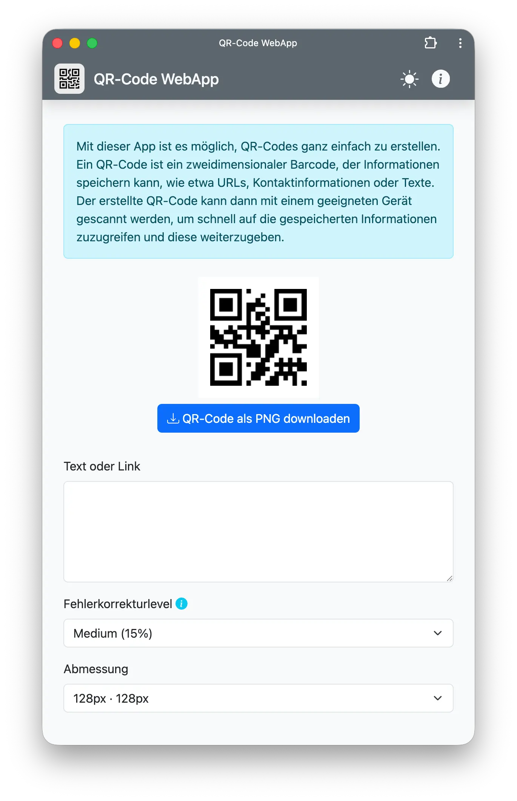

# QR-Code WebApp

## QR-Code WebApp

@copyright: © 2015-2025 Niederrhein Studio <niederrhein.studio>  
@author: Sascha Schneider <sc@niederrhein.studio>  
@license: AGPL 3.0 only

## Screenshot

## Beschreibung

Diese WebApp ermöglicht das Erstellen von QR-Codes im Browser. Es sind keine 
serverseitigen Komponenten erforderlich, da die QR-Codes komplett im Browser 
generiert werden. Die erstellten QR-Codes können als PNG-Bild heruntergeladen 
werden.

## Technologie

Die WebApp nutzt die JavaScript-Bibliothek
[QRCode.js](https://davidshimjs.github.io/qrcodejs/).

## Installation

Den Code als ZIP-Archiv downloaden und entpacken. Den Inhalt des Archives dann 
in den Root-Ordner der Webseite kopieren. Der QR-Code-Generator ist jetzt unter 
der URL der Webseite erreichbar.

Die WebApp kann auch lokal genutzt werden, indem die Datei `index.html` im 
Browser geöffnet wird.

## Nutzung

Die WebApp im Browser öffnen, den gewünschten Text eingeben und die
Einstellungen anpassen. Anschließend auf "QR-Code erstellen" klicken, um den 
QR-Code zu generieren. Der QR-Code wird dann angezeigt und kann
heruntergeladen werden. 

Beim Download wird das PNG-Bild des QR-Codes gespeichert.

## Changelog
### Version 25.11.9 (2025-11-9)
- Fehlerbehebungen und Verbesserungen beim Download von QR-Codes.
- Verbesserte Fehlermeldungen für den Nutzer.
- Verbesserte Barrierefreiheit durch Entfernen leerer `title`-Attribute.
- Aktualisierung der Copyright-Jahre.
- Aktualisierung der Lizenzinformationen.
- Allgemeine Code-Verbesserungen und Refactoring.
- Aktualisierung der Metadaten im Quellcode.
- Aktualisierung der README.md-Datei.
- Optimierung der Benutzeroberfläche und des Nutzererlebnisses.
- Verbesserte Kompatibilität mit verschiedenen Browsern und Geräten.
- Performance-Optimierungen beim Generieren von QR-Codes.
- Aktualisierung der Dokumentation und Anleitungen.
- Verbesserte Sicherheit und Stabilität der WebApp.
- Aktualisierung der Abhängigkeiten und Bibliotheken.
- Verbesserte Unterstützung für verschiedene QR-Code-Standards und -Formate.
- Optimierung der Ladezeiten und Ressourcennutzung.
- Verbesserte Unterstützung für mobile Geräte und Touch-Bedienung.
- Erweiterte Anpassungsmöglichkeiten für die QR-Code-Erstellung.
- Verbesserte Fehlerbehandlung und Debugging-Informationen. 
- Optimierung der Benutzerführung und Navigation innerhalb der WebApp.

### Version 15.12.5 (2015-12-5)
- Initiale Veröffentlichung der QR-Code WebApp.
- Erstellung von QR-Codes im Browser.
- Download der QR-Codes als PNG-Bild.
- Nutzung der QRCode.js Bibliothek.
- Vollständig clientseitige Implementierung ohne serverseitige Komponenten.
- Einfache Installation und Nutzung.
- Anpassbare Einstellungen für die QR-Code-Erstellung.
- Benutzerfreundliche Oberfläche für die QR-Code Generierung.
- Kompatibilität mit modernen Webbrowsern.
- Open-Source Lizenzierung unter AGPL 3.0.